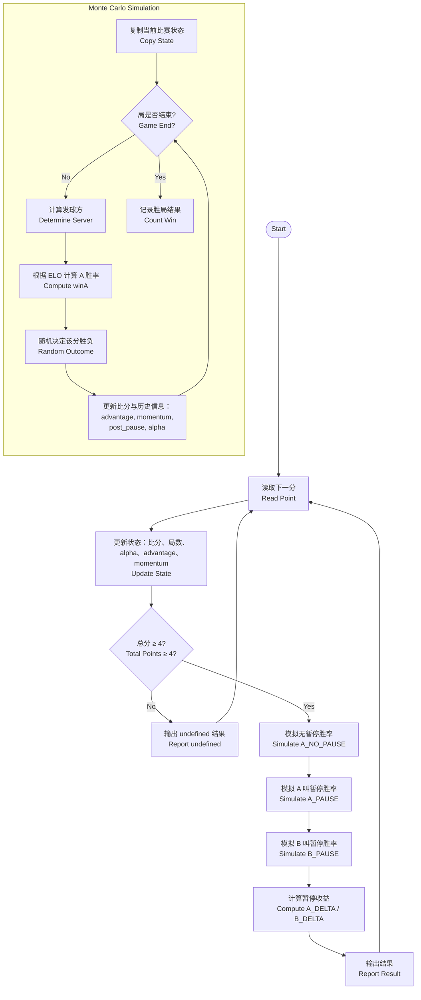

#### 20251002 研究日志

主题：确定乒乓球比赛势能量化研究方向，搭建简易计算模型

内容：今日核心工作围绕 “乒乓球比赛势能量化” 展开，明确了研究问题（量化比赛中球员的实时控制能力及势能变化规律）与核心终点（构建可迁移自网球势能逻辑、适配乒乓球规则的计算模型），并通过针对性文献调研锚定技术路径。

文献调研阶段，重点梳理了网球势能研究的诸多成果的研究思路和方法，初步锁定乒乓球势能的关键影响因素：选手实力、心理素质、热手效应等。在其中，深入研究了一篇使用 Monte Carlo Simulation 计算胜率的文章，分析其 “实时获胜概率（RTWP）→杠杆（单分影响幅度）→指数加权势能” 的核心逻辑。

模型搭建阶段，基于网球势能的量化框架，用 C++ 实现了简易的乒乓球势能计算模型：通过蒙特卡洛模拟计算每一分的实时获胜概率，进而推导杠杆值（$L_i = RTWP_{win} - RTWP_{lose}$），最终用指数加权平均（$\alpha=0.33$，同网球模型参数）计算球员 A（H）与球员 B（F）的实时势能（$M_A, M_B$）。模型可输出每一分后的势能变化，初步验证了 “得分序列驱动势能波动” 的合理性。

当前模型存在待优化方向：1）未适配乒乓球特有的发球轮换规则（网球为固定发球局，乒乓球每 2 分轮换发球，需补充发球方对得分概率的影响）；2）未纳入环境与技术细节（如回合数、球员跑动距离等）；

#### 20251006 研究日志

模型复杂化：1. 考虑发球对于势能的影响 2. 考虑发球、前三板技术对势能的影响 3. 考虑暂停、下一局对势能的影响

考虑 3：

运行两次，可见两者给出的结果几乎一样。

主题：加入更多影响因素，使模型更加拟合现实

内容：首先，完成了仅基于球员基础实力的预测模型搭建，经测试验证，该模型已能初步拟合现实比赛的基本规律。接着，修正了原模型在模拟过程中未将 “势能动态变化” 纳入考量的缺陷；不过当前实现代码的可维护性欠佳，后续需开展架构重构以提升扩展性。随后，进一步引入球员心理素质、临场发挥状态等多维特征，结合基础实力综合计算球员的 `elo_rating`，使模型对比赛进程的模拟更贴近真实场景。下一步，计划继续融入发球轮次、局点 / 赛点等关键赛制因素对 `elo_rating` 的影响，并通过设置合理阈值，辅助教练员和运动员判断比赛暂停的最佳时机。

问题：

有这样一条明显不合理的记录：

解决：

势能的主要影响因素：

1. 胜率
2. 连续得分

势能的次要影响因素：

1. elo rating
2. 当前分数得主

#### 20251126 研究日志

研究问题：

- 问题是什么：在体育比赛中，除了运动员本身实力外，动态变化的临场因素对结果同样关键。以乒乓球为例，连续得分、局点赛点、暂停时机等，均可能引发势能转移。 为精准量化乒乓球运动员实时竞技状态，辅助运动员和教练员做出暂停决策和选择相应战术，本文构建数学模型，通过实时计算暂停对当局胜率的影响，为运动员暂停时机的选择提供定量化依据。
- 别人如何研究或者看待这个问题？

武汉体育学院 - 硕士学位论文（专业型学位论文）- 乒乓球重大比赛中暂停 - 运用时机选取与效果研究：运用文献资料法、数理统计法和录像观察法，但缺乏确凿的定量证据，也不能为运动员和教练员提供实时的、量化的参考数据。

Changing Tides: MomentumSwings in Tennis(2425454.pdf)：使用 Monto Carlo 计算胜率，用于计算 leverage 和运动员势能。但会造成在局末阶段胜率变化不显著时，连续得分势能反而降低的不合理数据，模型正确性有待商榷。

基于二次移动平均法的乒乓球运动员张继科比赛态势分析：对比赛态势量化比较合理，但是较难用于实战中。

- 为什么需求这样一个工具？

对于业余球员来说，比赛时因为缺少教练等辅助人员站在旁观者视角辅助判断，容易错失暂停的最佳时机。本模型通过对比赛情况和运动员状态的量化数据，为运动员提供暂停时机的建议。

- 研究的内容具体目标是什么？

综合考量运动员实力、发球能力、心理素质、”进入状态“速度，以及实时计算的运动员比赛势能、综合优势、连续得分等，通过计算每一分的“暂停价值”（本模型用“暂停胜率-不暂停胜率”之差量化这个数），为运动员和教练员的暂停决策提供定量依据。

潜在影响因素：

- 实力：本模型以世界级经典比赛为例，以比赛举行当月球员积分为实力判断主要依据。对于业余球员，可以用“开球网”等积分来量化。
- 发球能力：可用“发球直接得分”和”前三板“等技术综合考量，决定这一项权值。
- 心理素质：可用体育网站上关于”逆转取胜“的统计数值决定这一项权值。
- ”进入状态“速度：由球员第一局胜率决定。
- 比赛势能：反映运动员得分状态，受历史几球得分情况决定，可以反映连续得分，也可以反映暂停对球员的胜率的影响。
- 综合优势：受球员进入状态速度、暂停等影响。由程序实时计算。

大致思路架构：

研究结果：

（以 2024 巴黎奥运会男单 1/4 决赛樊振东 vs 张本智和为例）

胜率变化曲线

势能变化曲线

